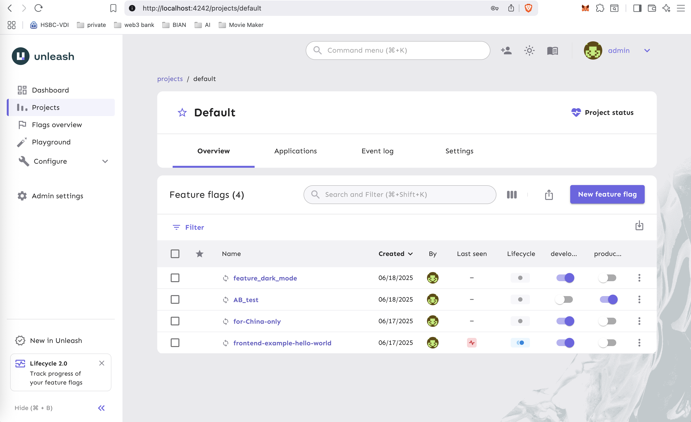

# Unleash Feature Flag Sample

This is a complete example project using Unleash Feature Flag, including both frontend and backend integration examples.

## Project Features

- Complete frontend and backend feature toggle integration
- High-performance cache implementation (frontend and backend)
- Consistent caching strategy (1-minute TTL)
- Thread-safe backend cache
- Automatic cache invalidation mechanism

## Project Overview

This project demonstrates how to integrate Unleash feature toggle (Feature Flag) system in both frontend and backend:

- Frontend uses `unleash-proxy-client` to communicate directly with Unleash server
- Backend uses Java SDK to communicate with Unleash server
- Supports both direct frontend checks and feature toggle status checks via backend API

## Prerequisites

- Node.js 18+
- Java 17+
- Maven 3.8+
- Unleash service running at `http://localhost:4242`

## Project Structure

```
├── frontend (root directory)
│   ├── index.html          # Main page
│   ├── package.json        # Frontend project configuration
│   └── src/
│       ├── main.js        # Frontend Unleash integration code
│       └── style.css      # Style file
│
└── backend/
    ├── pom.xml           # Maven project configuration
    └── src/main/
        ├── java/         # Java source code
        └── resources/    # Configuration files
```

## Detailed Documentation

- [Frontend Integration Guide](docs/frontend-integration-guide.md) - Detailed guide for frontend feature toggle integration
- [Backend Integration Guide](docs/backend-integration-guide.md) - Detailed guide for Java backend feature toggle integration

## Quick Start

### 1. Preparation

Install https://github.com/Unleash/unleash
In the Unleash admin panel (http://localhost:4242)

Execute the following commands:

git clone git@github.com:Unleash/unleash.git
cd unleash
```
docker compose up -d
```
Then point your browser to localhost:4242 and log in using:
```
username: admin
password: unleash4all
```
Create a feature flag:
- Name: `frontend-example-hello-world`
- Ensure it's Enabled



### 2. Start Frontend Service

1. Install dependencies:
```bash
npm install
```

2. Start development server:
```bash
npm run dev
```

3. Frontend service will run at http://localhost:5173

### 3. Start Backend Service

1. Enter backend directory:
```bash
cd backend
```

2. Start Spring Boot application:
```bash
mvn spring-boot:run
```

3. Backend service will run at http://localhost:8080

## Feature Testing

1. Open browser and visit http://localhost:5173

2. There are two buttons on the interface:
   - "Check Frontend Feature": Check feature toggle status directly through frontend SDK
   - "Check Backend Feature": Check feature toggle status through backend API

3. Test scenarios:
   - Click frontend check button: Get feature toggle status directly from Unleash
   - Click backend check button: Get feature toggle status via backend API
   - Modify feature toggle status in Unleash admin interface, then test both buttons' responses

4. Feature toggle status display:
   - When enabled: "New feature is enabled!"
   - When disabled: "Fallback to old logic"
   - When backend service is not running: Shows corresponding error message

## API Interface

### Backend API

- Feature toggle check endpoint
  - URL: `http://localhost:8080/api/feature-check`
  - Method: GET
  - Returns: Boolean (true: feature enabled, false: feature disabled)

## Tech Stack

### Frontend
- Vite
- unleash-proxy-client

### Backend
- Spring Boot 3.1
- unleash-client-java 8.0

## Performance Optimization

### Caching Mechanism
This project implements feature flag caching mechanisms in both frontend and backend to improve performance and reduce requests to the Unleash server:

1. **Frontend Cache**
   - Memory cache implemented using Map
   - 1-minute cache time
   - Automatic expiration and cleanup
   - Separate frontend and backend API caches

2. **Backend Cache**
   - Thread-safe cache implemented using ConcurrentHashMap
   - 1-minute cache time
   - Automatic expiration mechanism
   - Spring Bean lifecycle management

### Performance Improvements
- Reduced requests to Unleash server
- Improved API response speed
- Reduced server load
- Enhanced user experience

## Development Tips

1. Ensure Unleash server is running properly
2. Use the same feature toggle names in frontend and backend
3. Configure CORS correctly to allow frontend access to backend API
4. Use appropriate environment variables for configuration management

## Common Issues

1. Backend API 404: Check if backend service is running properly
2. Feature toggle not working: Check Unleash server connection and feature toggle configuration
3. CORS error: Check backend CORS configuration
